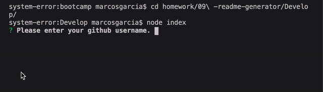

# ReadME Generator
## Table of Contents
- [Description](#description)
- [Installation](#installation)
- [Usage](#usage)
- [License](#license)
- [Contributing](#contributing)
- [Tests](#tests) 
- [Questions](#questions)

## Description
This command-line application uses 'inquirer' to prompt the user for information to be added to their ReadME 
      
## Installation
To install dependencies, run the following command: npm i

## Usage
node index

## License
This project is licensed under the Open license

## Contributing
To contribute to this project make a pull request

## Questions
To contact the author:

Reach out to me at GitHub : [marcos-cmd](https://github.com/marcos-cmd)
-------------------------------------------------------------
## NOTE: 
This ReadME was generated using this application. Here is the demo:

